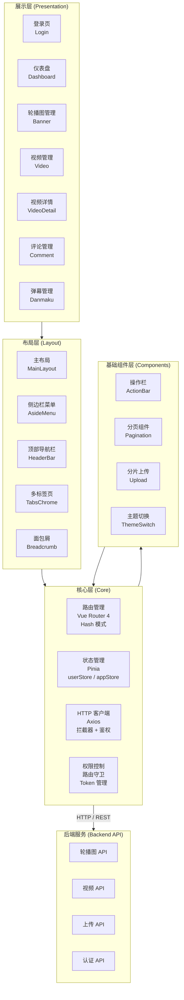
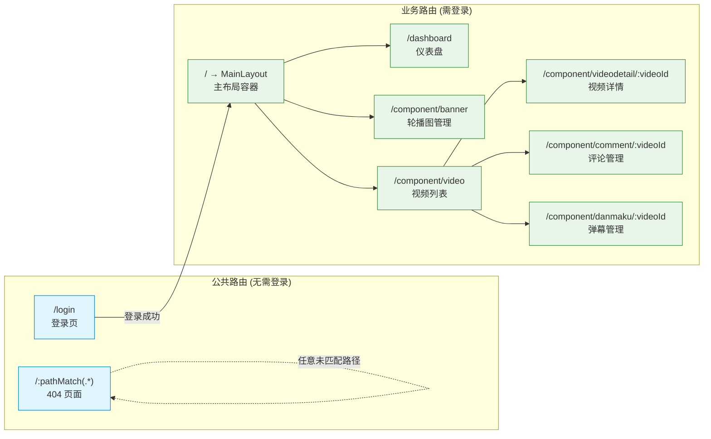
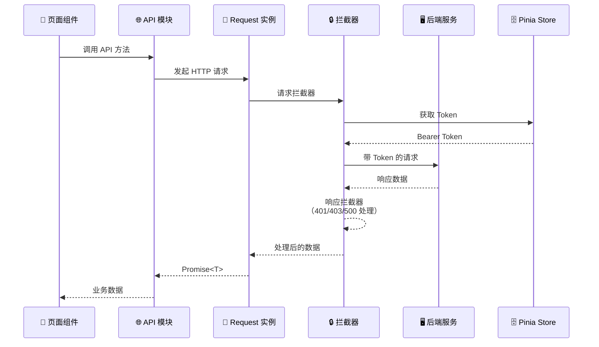

# zawakawa-admin

<p align="center">
  
  
  
  
  
  
</p>

一个基于 Vue 3 + TypeScript + Element Plus 的现代化中后台管理面板，专注于视频/动漫内容管理，提供轮播图、视频、弹幕、评论等全链路内容运营能力。

## 目录

- [系统架构](#系统架构)
- [技术栈](#技术栈)
- [特性](#特性)
- [项目结构](#项目结构)
- [功能模块](#功能模块)
- [核心设计](#核心设计)
- [部署说明](#部署说明)
- [贡献指南](#贡献指南)
- [许可证](#许可证)

## 系统架构

### 整体架构



### 路由架构



### 请求流程



## 技术栈

| 类别 | 技术 | 版本 | 说明 |
|------|------|------|------|
| **框架** | Vue | ^3.2.45 | Composition API + `<script setup>` |
| **语言** | TypeScript | ^5.0.2 | 全项目使用，strict 模式 |
| **构建** | Vite | ^4.3.9 | 极速开发体验 |
| **UI 组件库** | Element Plus | ^2.3.6 | 中文 locale |
| **状态管理** | Pinia | ^2.1.4 | 替代 Vuex，支持持久化 |
| **路由** | Vue Router | 4 | Hash 模式 |
| **HTTP 客户端** | Axios | ^1.4.0 | 封装请求/响应拦截器 |
| **CSS 预处理** | Sass | ^1.53.0 | scoped SCSS |
| **工具集** | @vueuse/core | ^8.7.5 | 暗色模式、全屏、媒体查询 |
| **进度条** | nprogress | ^0.2.0 | 路由切换进度指示 |
| **文件处理** | spark-md5 | ^3.0.2 | 浏览器端 MD5 计算（分片上传） |
| **JWT** | jwt-decode | ^4.0.0 | Token 解析 |
| **持久化** | good-storage | ^1.1.1 | localStorage 封装 |
| **工具库** | lodash | ^4.17.21 | cloneDeep 等 |

## 特性

- **Composition API** — 全项目采用 `<script setup lang="ts">`，代码简洁、逻辑清晰
- **TypeScript 严格模式** — 完整的类型推导与检查，减少运行时错误
- **暗色模式** — 基于 `@vueuse/core` 的 `useDark` 实现，一键切换深色/浅色主题，Element Plus 全组件适配
- **Chrome 风格多标签页** — 自研标签页导航组件，支持打开、切换、关闭，状态持久化
- **大文件分片上传** — 支持最大 2GB 的 MP4 视频上传，浏览器端 MD5 计算 + 断点续传
- **响应式布局** — 自适应侧边栏（桌面端侧边栏 / 移动端抽屉式），面包屑在小屏自动隐藏
- **精细化权限控制** — 路由守卫 + Token 鉴权 + 请求/响应拦截器，覆盖完整的认证流程
- **可复用的交互模式** — 封装 ActionBar（搜索+操作栏）和 Pagination（分页）组件，统一列表页开发范式

## 项目结构

```
zawakawa-admin/
├── public/
│   └── favicon.ico                  # 网站图标
├── src/
│   ├── api/                         # API 接口层
│   │   ├── banner/index.ts          #   轮播图 CRUD
│   │   └── video/index.ts           #   视频 CRUD + 分片上传
│   ├── components/                  # 可复用组件
│   │   ├── ActionBar.vue            #   操作栏（添加按钮 + 搜索 + 查询/重置）
│   │   ├── Pagination.vue           #   通用分页组件
│   │   ├── HelloWorld.vue           #   Vite 脚手架模板（待清理）
│   │   └── tabsChrome/              #   Chrome 风格标签页组件
│   │       ├── Tab.vue              #     单个标签页
│   │       ├── TabsChromeX.vue      #     标签页容器
│   │       └── tab.d.ts            #     Tab 类型定义
│   ├── compositionApi/              # 组合式函数
│   │   └── pagination.ts           #   分页逻辑复用
│   ├── config/                      # 全局配置
│   │   ├── app.ts                  #   应用常量（前缀、名称、分页大小等）
│   │   ├── options.ts              #   本地字典（性别等）
│   │   └── request.ts             #   HTTP 配置（baseURL、超时、状态码映射）
│   ├── router/                      # 路由配置
│   │   ├── index.ts                #   路由主文件（Hash 模式 + 动态注册）
│   │   ├── menu.ts                 #   侧边栏菜单生成逻辑
│   │   ├── type.d.ts              #   路由元信息类型定义
│   │   ├── common.ts              #   公共路由（登录、404）
│   │   ├── component.ts           #   内容管理路由（Banner、视频、评论、弹幕）
│   │   ├── dashboard.ts           #   仪表盘路由
│   │   └── user.ts                #   用户管理路由
│   ├── stores/                      # Pinia 状态管理
│   │   ├── app.ts                 #   应用状态（标签页、侧边栏、暗色模式）
│   │   └── user.ts               #   用户状态（Token、用户信息）
│   ├── utils/                       # 工具函数
│   │   ├── app.ts                 #   通用工具（resetArgs、saveBlob、toFormData）
│   │   ├── loadComponents.ts      #   全局组件注册
│   │   ├── request.ts            #   Axios 封装（拦截器 + 鉴权）
│   │   ├── routerHook.ts         #   路由守卫 + nprogress
│   │   ├── uploadFile.ts         #   分片上传（MD5 计算 + 断点续传）
│   │   └── user.ts               #   Token/用户信息 localStorage 读写
│   ├── views/                       # 页面视图
│   │   ├── common/
│   │   │   ├── 404.vue           #   404 页面
│   │   │   ├── Login.vue         #   登录页
│   │   │   └── Upload.vue        #   视频分片上传组件
│   │   ├── component/
│   │   │   ├── banner/Index.vue          #   轮播图管理
│   │   │   └── video/
│   │   │       ├── Index.vue             #   视频列表
│   │   │       ├── videoDetail/Index.vue  #   视频详情/添加/编辑
│   │   │       ├── comment/Index.vue      #   评论管理（占位）
│   │   │       └── danmaku/Index.vue      #   弹幕管理（占位）
│   │   ├── dashboard/Index.vue           #   仪表盘首页
│   │   └── layout/                       #   布局组件
│   │       ├── MainLayout.vue            #     主布局容器
│   │       ├── AsideMenu.vue             #     侧边栏菜单
│   │       ├── HeaderBar.vue             #     顶部导航栏
│   │       ├── TabsChrome.vue            #     多标签页
│   │       ├── Breadcrumb.vue            #     面包屑
│   │       ├── Fullscreen.vue            #     全屏切换
│   │       ├── RouteMenu.vue             #     递归菜单渲染
│   │       └── ThemeSwitch.vue           #     暗色模式开关
│   ├── App.vue                   #   根组件
│   ├── main.ts                   #   应用入口
│   └── env.d.ts                  #   环境变量类型声明
├── .env.development              # 开发环境变量
├── .env.production               # 生产环境变量
├── index.html                    # HTML 入口
├── package.json                  # 依赖与脚本
├── tsconfig.json                 # TypeScript 配置
├── vite.config.ts                # Vite 构建配置
├── pnpm-lock.yaml                # 依赖锁文件
└── LICENSE                       # MIT 许可证
```

## 功能模块

### 内容管理

| 模块 | 功能 | 状态 |
|------|------|------|
| **轮播图管理** | 添加、编辑、删除轮播图，支持类型筛选（新番/番剧/剧场） | ✅ 已完成 |
| **视频管理** | 视频列表展示、搜索、编辑、删除，分页查询 | ✅ 已完成 |
| **视频详情** | 视频信息编辑（标题、评分、主演、类别、集数、封面等） | ✅ 已完成 |
| **视频上传** | MP4 大文件分片上传（最大 2GB），MD5 计算，断点续传 | ✅ 已完成 |
| **封面上传** | 视频封面图片上传（PNG/JPEG/WebP） | ✅ 已完成 |
| **评论管理** | 根据视频 ID 管理评论 | 🚧 占位 |
| **弹幕管理** | 根据视频 ID 管理弹幕 | 🚧 占位 |

### 系统功能

| 功能 | 说明 |
|------|------|
| **用户认证** | 用户名/密码登录，JWT Token 鉴权，登录过期自动跳转 |
| **暗色模式** | 一键切换深色/浅色主题，Element Plus 全组件适配 |
| **多标签页** | Chrome 风格标签页导航，支持打开/关闭/切换，状态持久化 |
| **响应式布局** | 桌面端侧边栏 + 移动端抽屉式菜单 |
| **全屏模式** | 一键进入/退出浏览器全屏 |

## 核心设计

### 请求链路

项目基于 Axios 封装了完整的请求链路：

1. **请求拦截器** — 自动注入 `Authorization: Bearer <token>` 请求头，支持 FormData 自动转换
2. **响应拦截器** — 统一处理 401（未授权）、403（禁止访问）、500（服务器错误）等状态码
3. **Token 管理** — Token 存储在 Pinia + localStorage 中，路由守卫拦截未登录请求

### 状态管理

项目使用 Pinia 进行状态管理，包含两个核心 Store：

- **userStore** — 用户信息（name、token、refreshToken），持久化至 localStorage
- **appStore** — 应用 UI 状态（侧边栏折叠、暗色模式、标签页列表），均支持持久化

### 分片上传

大文件上传采用分片策略，避免一次性上传大文件导致的超时和内存问题：

```
选择文件 → 计算文件 MD5（2MB 分片）→ 询问服务端已上传分片 → 逐个上传缺失分片（5MB 每片）→ 完成
```

### 布局架构

布局采用经典的「顶部导航 + 侧边栏 + 主内容区」三段式结构：

- **Header** — 左侧折叠按钮 + 面包屑，右侧全屏/暗色模式/用户菜单
- **Aside** — 递归渲染的动态菜单，支持折叠（250px / 64px），移动端自动切换为 Drawer
- **Main** — 多标签页容器 + 路由视图渲染

### 暗色模式

暗色模式的实现方案：

- 使用 `@vueuse/core` 的 `useDark`，自动管理 `<html>` 上的 `.dark` 类
- 导入 Element Plus 暗色 CSS 变量
- 自定义 ThemeSwitch 组件，提供月亮/太阳 SVG 图标切换动画
- 状态持久化至 localStorage，刷新不丢失

## 部署说明

### 环境要求

- Node.js >= 16
- pnpm（推荐）或 npm / yarn

### 环境变量配置

项目通过 `.env.*` 文件管理环境变量：

```bash
# .env.development
ENV = 'development'
VITE_BASE_URL = http://localhost:8081         # 后端 API 地址

# .env.production
ENV = 'production'
VITE_BASE_URL = http://47.243.38.86:8081      # 生产环境 API 地址
```

### 构建与部署

```bash
# 安装依赖
pnpm install

# 开发模式（默认端口 3003，基础路径 /admin）
pnpm dev

# 生产构建
pnpm build
```

构建产物输出至 `dist/` 目录，部署时将 `dist/` 下的文件上传至 Web 服务器的 `/admin` 路径下即可。

> **提示：** 项目构建基础路径为 `/admin`，如需修改，请编辑 `vite.config.ts` 中的 `base` 字段。

### 代码规范

- 所有 Vue 文件使用 `<script setup lang="ts">`
- TypeScript strict 模式，已配置 `noUnusedLocals` 和 `noUnusedParameters`
- 使用 Sass scoped 样式
- 遵循项目已有的目录结构和命名惯例
